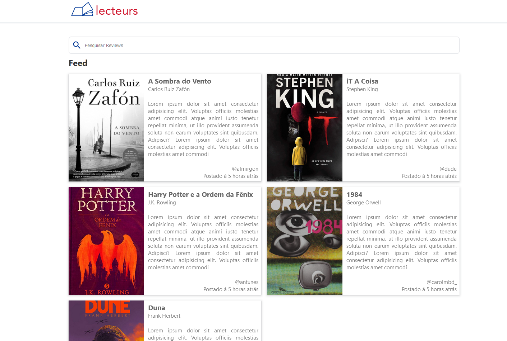
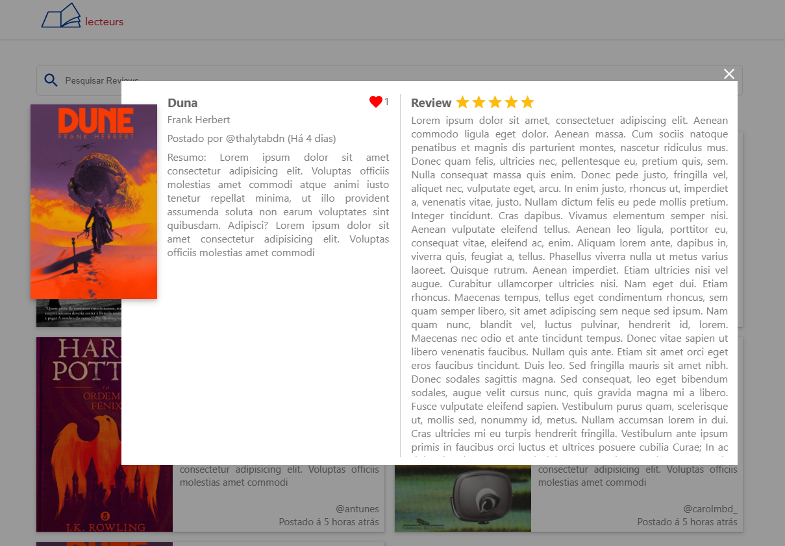
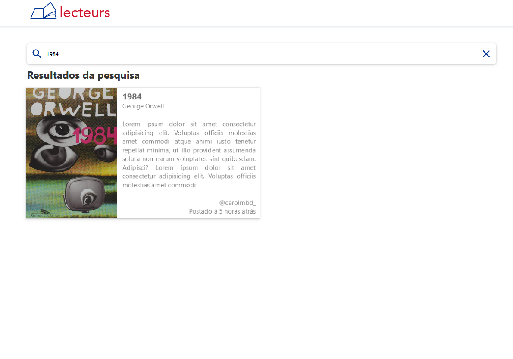
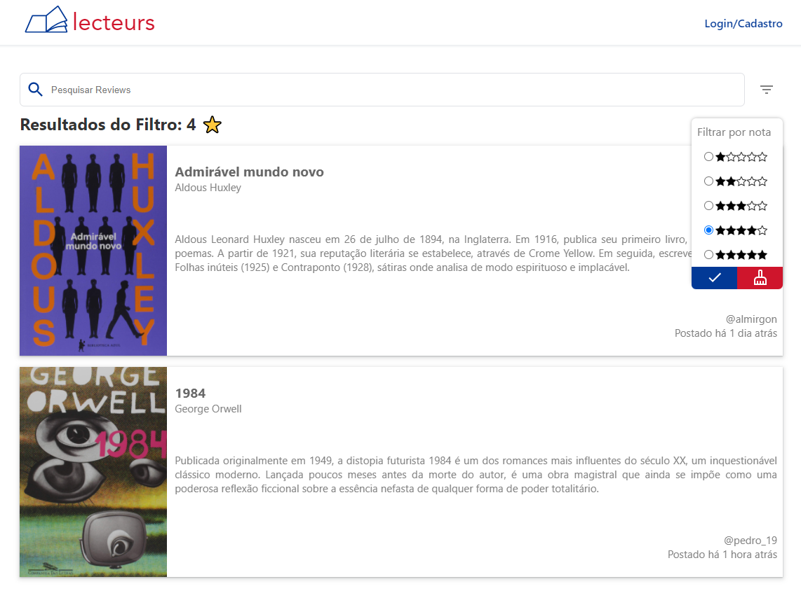

# lecteurs 📚 - Projeto disciplina DevWeb - 2021.1e

O Lecteurs é uma aplicação web que imita uma rede social para leitores compartilharem diferentes reviews sobre livros que leram. 

## Funcionalidades

* Cadastro de usuários
* Autenticação de usuários
* Compartilhamento de review com titulo, texto, nota e imagem
* Atribuição de nota a um livro (Apenas usuário logado e dono da review)
* Curtidas (Apenas usuários logados)
* Visualização de Review (Qualquer usuário)
* Feed para compartilhamento das reviews 
* Filtrar por nota 
* Buscar por título ou autor
* Edição de review (Apenas usuário logado e dono da review)

## Telas

* Tela inicial (Feed): Formada por cards clicaveis que representam uma review com titulo, texto (Resumo de 350 caracteres), nota, imagem e usuário que a publicou. Além disso, a tela de feed irá ter um filtro por nota e uma barra de busca (autor ou livro)
* Modal: Cada card do feed abre um modal que apresenta o texto completo (review) junto ao resumo do livro. Um usuário logado pode curtir a review
* Tela de Login/Cadastro: Ao clicar no botão no header um usuário entra em uma página para logar ou criar um cadastro no lectures. 
* Tela de Postagem: Tela com um form, na qual um usuário logado pode postar suas reviews no feed
* Tela de Pesquisa e filtro: Formada por um card clicavel que representam a review encontrada
* Tela de Edição: Tela com um form, na qual um usuário logado pode editar a sua review

##Desenvolvimento 

* O frontend da aplicação foi desenvolvido utilizando React junto ao formik, axios, react-simple-star-rating, react-images-uploading, sweetalert2 e yup
* O backend da aplicação foi desenvolvido utilizando NodeJS junto ao aws-sdk, bcrypt, express, jsonwebtoken, mysql e nodemon

## Aplicação 

